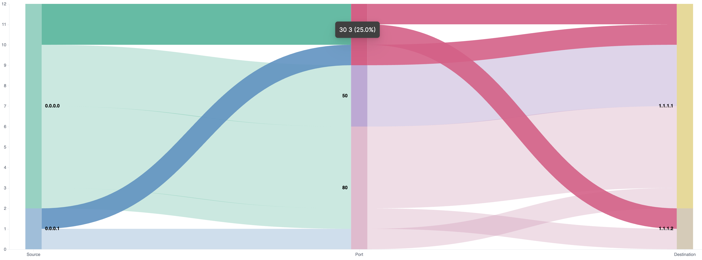

# Three Stack Sankey chart in Vega

This is an example of a three stack sankey chart written in Vega.



## Files

```tree
.
├── README.md <- This file
├── img
│   └── example.png <- Picture above
├── sampledata.js <- Data that can be used for the chart
└── sankey.json <- Vega declaration for the Sankey chart
```
